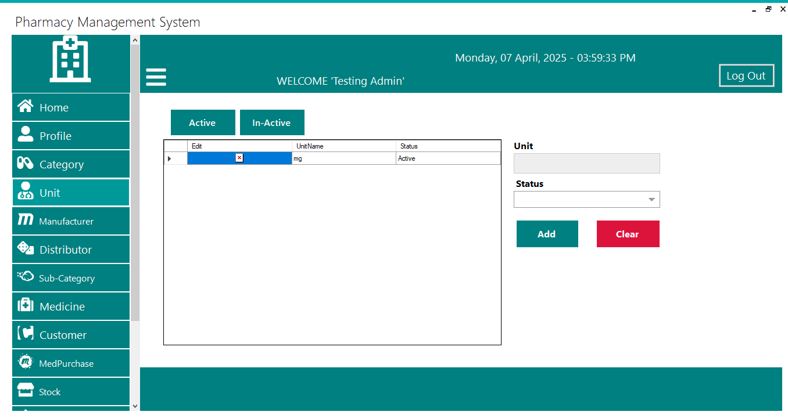

# 💊 Pharmacy Management System

Pharmacy Management System is a **C# Windows Forms Application** built using **.NET Framework 4.5.2**, designed to efficiently manage pharmacy operations such as medicine inventory, purchases, sales, returns, and customer management.  
The application uses advanced tools and libraries like **Crystal Reports**, **MetroFramework**, **FontAwesome.Sharp**, and **iTextSharp** for an enhanced user interface and robust reporting.

---

## ⚙️ Technologies Used

- **C# (Windows Forms)**
- **.NET Framework 4.5.2**
- **Crystal Reports** (For Reporting)
- **MetroFramework** (Modern UI Design)
- **FontAwesome.Sharp** (Icons)
- **iTextSharp** (PDF Generation)

---

## 🚀 Features Overview

### 🔐 User Registration & Login
- New users can register and are redirected to the login form.
- Secure login using email and password.
- On successful login, users are directed to the main application.

### 🏠 Home Dashboard
- Displays an overview of all major modules:
  - Categories, Units, Manufacturers, Distributors
  - Subcategories, Medicines, Customers
  - Medicine Purchases, Stock Management
  - Purchase Returns, Medicine Sales, Sale Returns

### 👤 Profile Management
- Update profile details via **Update Profile** button.

### 📦 Master Data Management
- Manage **Categories**, **Units**, **Manufacturers**, **Distributors**, **Subcategories**, **Customers**, and **Medicines**.
- Add new entries.
- View all records with **Active** and **Inactive** status filters.
- Data is displayed neatly in grids within each form.

### 💰 Medicine Purchase Management
- Select medicines and enter purchase details.
- Use **"Add More?"** to add multiple medicines dynamically.
- Selected medicines are listed in the side panel.
- Confirm purchase to save in the database.
- **Purchase Details Tab**:
  - View complete purchase history.
  - Filter records by **Paid** and **Unpaid** purchases.

### 📊 Stock Management
- View available stock quantities.
- Filter to view **Out of Stock** medicines.

### 🔄 Purchase Return Management
- Enter the invoice number to verify the purchase.
- Select medicine and quantity to return.
- Return details are displayed dynamically in the grid.

### 🛒 Medicine Sale Management
- Select medicines and input sale details.
- Check available quantity before adding more.
- Use **"Add More?"** for multiple items.
- Confirm sale to save transaction.
- **Sale Details Tab**:
  - View all sales history.
  - Filter records by **Paid** and **Unpaid** sales.

### 🔁 Sale Return Management
- Enter the invoice number to verify the sale.
- Select medicines and quantities for return.
- Sale return details are displayed dynamically.

### 📝 Reports Generation
- Generate reports for:
  - Categories
  - Customers
  - Distributors
  - Manufacturers
  - Medicines
  - Purchases and Sales
  - Returns
- Export reports using **Crystal Reports** and **iTextSharp**.

---

## 🖥️ Installation & Setup

1. **Clone the Repository**
   ```bash
   git clone https://github.com/your-username/Pharmacy-Management-System.git


## 🖼️ Screenshots

### Login Page


### Home


### Profile


### Categories


### Units


### Manufacturers


### Distributors


### Subcategories


### Medicine


### Customer


### Medicine Purchase


### Stock


### Purchase Return


### Medicine Sale


### Sale Return


### Reports


